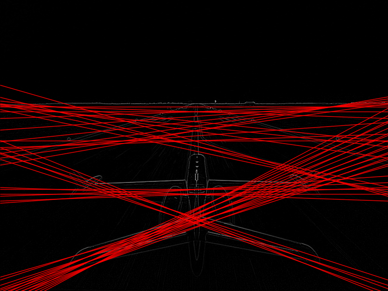

# Proyecto 3
## Transformada de Hough con CUDA
**Universidad del Valle de Guatemala**\
**Facultad de Ingeniería**\
**Departamento de Ciencias de la Computación**\
**Computación Paralela**

---
### Autores:
- Diego Leiva
- Pablo Orellana

---
## Uso
### Compilacion
Para compilar los programas con versiones de Transformada de Hough solo debe de hacer uso del `makefile`
para ello en su terminal ejecute:
```bash
make
```
Esto generara 3 archivos:
- `houghGlobal`: Version del programa que utiliza memoria global
- `houghConstant`: Version del programa que utiliza memoria global y constante
- `houghShared`: Version del programa que utiliza memoria global, constante y compartida

### Ejecucion
Para ejecutar cualquiera de las versiones utilice el siguiente comando
```bash
.src/executables/hough<Version>  <input_image.pgm>
```

Donde se tiene que reemplazar Version por:
-  `Global`
-  `Constant`
-  `Shared`

El output se genera en la carpeta `output` bajo alguno de estos nombres:
```bash
output_<version>.png
```

## Output
### En consola
```bash
CPU Execution Time: <cpu_time> ms
GPU Execution Time for Global: <gpu_time> ms

Comparing CPU and GPU results...
SUCCESS: No mismatches found
or 
ERROR: <mismatch_num> mismatches found 

Generating output image...
Info -> Threshold value: <threshold value>
Info -> Mean value: <line_weight_mean>, Standard deviation: <standard deviation>
SUCCES: Output image saved as 'output.png'
```

### Imagen con lineas detectadas
